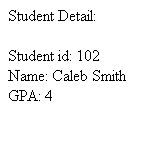

# Student Database Backend

This project focuses on creating a basic student database using Express.js and Node.js. The server handles POST requests for adding student details, provides endpoints for retrieving and displaying all student data, finds specific student details by ID, and identifies the student with the highest GPA.

## Table of Contents

- [Introduction](#introduction)
- [Features](#features)
- [Installation](#installation)
- [Usage](#usage)
- [Screenshots](#screenshots)
- [License](#license)
- [Additional Information](#additional-information)

## Introduction

The goal of this project is to create a basic student database using Express.js and Node.js. The objectives are to handle POST requests for adding student details, create endpoints for retrieving and displaying all student data, find particular student’s details by ID, and assess which student has the greatest GPA.

## Features

- Handling POST requests for adding student details.
- Creating endpoints for retrieving and displaying all student data.
- Finding specific student details by ID.
- Identifying the student with the highest GPA.

## Installation

1. Clone the repository:
   ```
   git clone https://github.com/nknithi/student-database.git
   ```
2. Navigate to the project directory:
    ```
   cd student-database
   ```
To install the necessary packages, run the following command:

```
npm install
```
## Usage

To start the server, run:

```
node index.js
```
## Screenshots

<p align="center">
  <strong>All Students Page</strong><br><br>
  
</p>

<p align="center">
  <strong>Specific Student Page</strong><br><br>
  
</p>

<p align="center">
  <strong>Postman Testing</strong><br><br>
  
</p>

<p align="center">
  <strong>Topper Page</strong><br><br>
  
</p>

## License

This project is not licensed.

## Additional Information

For any questions or further information, please contact [nknithi2018@gmail.com](mailto:nknithi2018@gmail.com).
